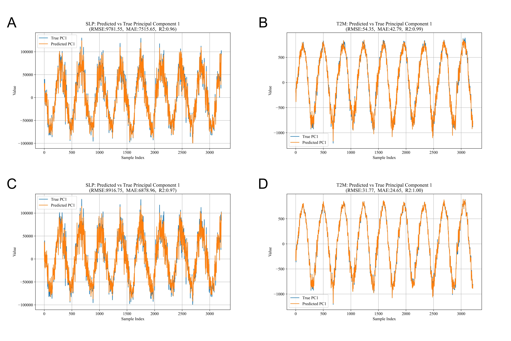

# 🌀 ME5311 Project: Data-Driven Analysis of Indo-Pacific Climate Using PCA, DMD, and LSTM

This project explores a data-driven framework combining **Principal Component Analysis (PCA)**, **Dynamic Mode Decomposition (DMD)**, and **Long Short-Term Memory (LSTM)** networks to analyze and forecast Indo-Pacific climate variability.

---

## 📁 Project Structure

```
├── main.ipynb             # Main notebook with all code
├── data/                  # Folder containing SLP and T2M reanalysis datasets
├── figures/
│   ├── Figure1.jpg        # PCA & DMD modal visualization
│   └── Figure2.jpg        # Forecasting results comparison (DMD vs LSTM)
├── report/
│   └── PROJECT.pdf        # Final academic report
```

---

## 🌍 Dataset Overview

- **Region:** Indo-Pacific (70°E–150°E, 10°S–40°N)
- **Resolution:** 0.5° × 0.5°
- **Variables:** Sea Level Pressure (SLP) & Two-Meter Temperature (T2M)
- **Time Range:** 1979-12-31 to 2022-12-31 (16,071 daily records)

---

## ⚙️ Methodology Overview

### 🔹 PCA (Principal Component Analysis)
- Reduces high-dimensional climate fields (16,261 spatial grid points) to 15 dominant modes.
- Retains >95% of the total variance for both SLP and T2M.

### 🔹 DMD (Dynamic Mode Decomposition)
- Constructs a linear dynamical system using PCA-reduced data.
- Produces interpretable modes with frequency and growth rate.
- Enables short-term **single-step prediction**.

### 🔹 LSTM (Long Short-Term Memory)
- Captures nonlinear time dependencies using a 128-unit LSTM.
- Forecasts next time step using 10-step sequences.
- Outperforms DMD in accuracy on all metrics.

---

## 🖼 Visual Results

### 📌 PCA & DMD Modal Analysis


- **A–D**: First 4 PCA modes for SLP  
- **E–H**: First 4 PCA modes for T2M  
- **I–J**: DMD eigenvalues in complex plane (stability analysis)  
- **K–L**: Dominant DMD spatial structures

---

### 📌 Forecasting Comparison (DMD vs LSTM)


- **A–B**: DMD-predicted vs actual PC1 (SLP & T2M)
- **C–D**: LSTM-predicted vs actual PC1 (SLP & T2M)  
- 🔍 LSTM better captures amplitude & phase with higher R²

---

## 📊 Quantitative Results

| Model | Variable | Mean RMSE | Mean MAE | Mean R² |
|-------|----------|-----------|----------|---------|
| **DMD**  | SLP      | 4742.16   | 3700.29  | 63.00%  |
| **DMD**  | T2M      | 21.50     | 16.77    | 71.00%  |
| **LSTM** | SLP      | 3791.38   | 2943.24  | 77.00%  |
| **LSTM** | T2M      | 20.15     | 15.71    | 78.50%  |

---

## 🚀 How to Run

1. Clone the repository  
   ```bash
   git clone https://github.com/your-username/your-repo.git
   cd your-repo
   ```

2. Open `main.ipynb` in Jupyter or VSCode

3. Install requirements (if not already)
   ```bash
   pip install numpy matplotlib xarray scikit-learn tensorflow
   ```

4. Run all cells to reproduce PCA, DMD, and LSTM results

---

## 📄 Report

You can read the full report [here](./PROJECT.pdf)

---

## 🙏 Acknowledgment

Special thanks to **Prof. Gianmarco Mengaldo** for his exceptional teaching, guidance, and inspiration. This work was completed as part of the **ME5311** course at the National University of Singapore. The guest lecture by NVIDIA and hands-on coding sessions significantly enhanced our understanding of data-driven modeling.

---

## 🔗 Citation & License

If you use this project, please cite the report or code.  
Code is for educational use under MIT License unless otherwise noted.

---

## 📌 Keywords

`Data-Driven Modeling` • `Climate Forecasting` • `Principal Component Analysis` • `Dynamic Mode Decomposition` • `LSTM`
